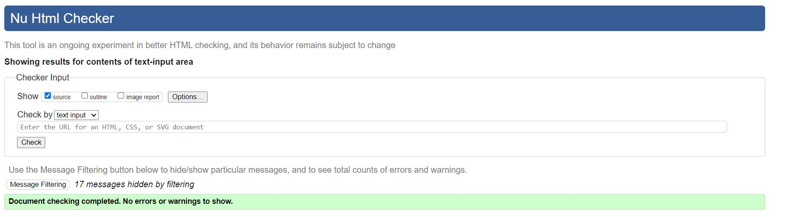
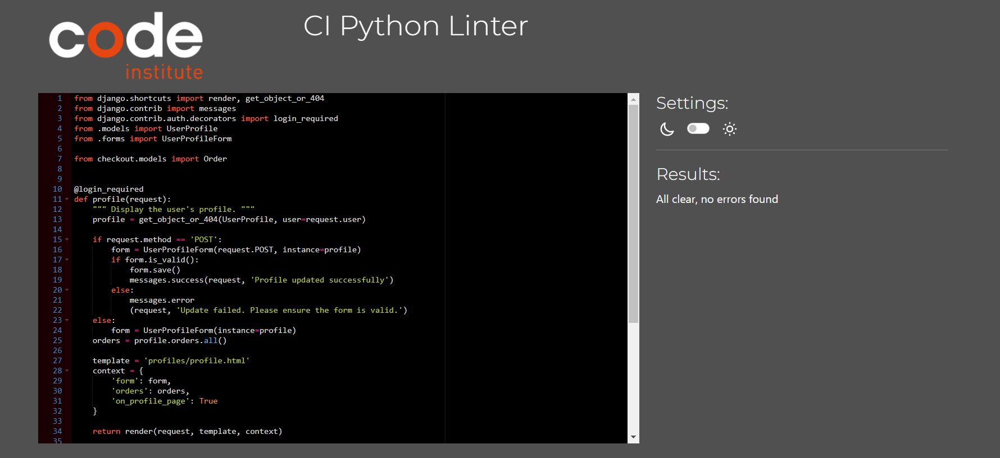

# Testing

Return back to the [README.md](README.md) file.

## Code Validation

In this section I ran validation for all the code I produced in the project. I found bugs in the code and fixed them, in order for it to work optimally and pass the tests.

### HTML

I have used the recommended [HTML W3C Validator](https://validator.w3.org) to validate all of my HTML files.

only one error appears as it shown in the above image, tried to fix it but couldn't find the location of the error in the code. moved all the charset in the meta at the top of the base template but still having the error. 
### CSS

I have used the recommended [CSS Jigsaw Validator](https://jigsaw.w3.org/css-validator) to validate all of my CSS files.

### JavaScript

I have used the recommended [JShint Validator](https://jshint.com) to validate all of my JS files.

 

### Python

I have used the recommended [CI Python Linter](https://pep8ci.herokuapp.com) to validate all of my Python files.

#### Checkout view.py

#### product view.py

#### profile view.py

#### bag view.py

## Responsiveness

I've tested my deployed project on multiple devices to check for responsiveness issues.

 #### Mobile (DevTools)  
 
   Works as expected 
 
 #### Tablet (DevTools) 
 
 Works as expected 
 
#### Desktop (DevTools) 

  

## Lighthouse Audit

I've tested my deployed project using the Lighthouse Audit tool to check for any major issues.

## Defensive Programming

Defensive programming was manually tested with the below user acceptance testing:

| Page | User Action | Expected Result | Pass/Fail | Comments |
| --- | --- | --- | --- | --- |
| Home Page | | | | |
| | Click on Logo | Redirection to Home page | Pass | |
| | Click on Home link in navbar | Redirection to Home page | Pass | |
| | Click on Home link in Sign in page | Redirection to Home page | Pass | |
| | Click on Cancel link in Logout page | Redirection to Home page | Pass | |
| | Search bar display in every page and functionality | Search bar is displayed in every page as expected and functionality works as expected | Pass | When the search bar is clicked on but no characters (no query) is input in it and enter is pressed or the magnifying glass icon is clicked or tapped on, an error message will be generated, indicating the user to do so in order to search |
| About Us Page | | | | |
| | Click on About Us link in navbar | Redirection to About Us page | Pass | |
| | Click on About Us link in footer | Redirection to About Us page | Pass | |
| | Click on About Us page external links | External links open in new page | Pass |
| | Click on the Cancel link in the Contact us page | Redirection to All Games page showing all games for all platforms | Pass | |
| | Click on the Cancel link in the Newsletter page | Redirection to All Games page showing all games for all platforms | Pass | |
| | Click on the Cancel link in the Add perfume (Game management) page | Redirection to All Games page showing all games for all platforms | Pass | |
| | Click on the Cancel link in the Edit game (Game management) page | Redirection to All Games page showing all games for all platforms | Pass | |
| | Click on the Cancel link in the Delete game (Game management) page | Redirection to All Games page showing all games for all platforms | Pass | |
| | Click on the Keep shopping link in the Game detail page | Redirection to All Games page showing all games for all platforms | Pass | |
| | Click on the Keep shopping link in the Basket page | Redirection to All Games page showing all games for all platforms | Pass | |
| | Click on a specific game card in the Games page | Redirection to the corresponding specific game detail page | Pass | |
| | Load images, names, prices, platforms and likes count for games | All info is loaded as expected | Pass | |
| | Free delivery offer banner display | Free delivery offer banner is displayed as expected | Pass | |
| | Sort by bar display and functionality | Sort by bar is displayed as expected and functionality works as expected | Pass | |
| | Logged in as Superuser | Edit and Delete buttons will show | Pass | |
| Game Detail Page | | | | |
| | Load image, name, price, quantity, platform, pegi rating, genre, year, likes count, available in other platforms, description and trailer for game | All info is loaded as expected | Pass | |
| | Click on the custom quantity buttons or the built in ones in the form, will adjust the game quantity that will be added to the basket | All quantity buttons work as expected | Pass | |
| | Click on Add to basket button | Effectively adds the game(quantity) to the shopping basket | Pass | A message will show at the top of the page to indicate the user they've added the game to the basket successfully |
| | Click on platform button | Redirection to Games page showing the games of that particular platform | Pass | |
| | Click on pegi button | Redirection to Games page showing the games of that particular pegi | Pass | |
| | Click on genre button | Redirection to Games page showing the games of that particular genre | Pass | |
| | Click on like button | Should the user not be logged in, the like button will be disabled, once they login they will be able to click on the like button to like/unlike the game | Pass | A message will show at the top of the page to indicate the user they've liked/unliked the game successfully |
| | Game trailer will not autoplay | When the game detail page is loaded, the game trailer will load but it will not autoplay, the user can play it should they choose to | Pass | |
| | Logged in as Superuser | Edit and Delete buttons will show | Pass | |
| Contact Us Page | | | | |
| | Click on Contact Us link in navbar | Redirection to Contact Us page | Pass | |
| | Click on Contact Us link in home page bottom | Redirection to Contact Us page | Pass | |
| | Click on Contact Us link in footer | Redirection to Contact Us page | Pass | |
| | Click on any of the Contact Us links in privacy policy modal | Redirection to Contact Us page | Pass | |
| | Click on Contact Us link in Password reset page | Redirection to Contact Us page | Pass | |
| | Contact Us page will load a contact form for the user to fill out | Contact us form, loads as expected | Pass | Should the user be logged in, the full name and email address fields in the form will be prefilled with the user's information |
| | Click on the Send button without requiered form values | An error will show on the form to indicate the user what's missing | Pass | |
| | Click on the Send button | Sends the user's info including message, to the Contact database table | Pass | A message will show at the top of the page to thank the user for contacting the store |
| Contact List Page | | | | |
| | Click on Contact list link in navbar | Redirection to Contact list page | Pass | |
| | Display Contact list | All users and their information (including messages) that have contacted the site admin will be displayed | Pass | |
| | Brute forcing the URL to get to Contact list page without logging in first | User will be redirected to Login page | Pass | |
| | Brute forcing the URL to get to Contact list page logged in not as a Superuser | User will be redirected to Home page and an error will show at the top of the page to indicate the user that only store owners can do that | Pass | If user is not logged in, they will be redirected to login page |
| Register | | | | |
| | Click on Register link in navbar, | Redirection to Register page | Pass | |
| | Enter valid first name | Field will accept free text format | Pass | |
| | Enter valid last name | Field will accept free text format | Pass | |
| | Enter valid username | Field will accept free text format | Pass | |
| | Enter valid email address (twice) | Field will only accept email address format | Pass | |
| | Enter valid password (twice) | Field will only accept password format | Pass | |
| | Click on the Register button without requiered form values | An error will show on the form to indicate the user what's missing | Pass | |
| | Click on Register button | User is sent a confirmation email where they need to click on the link provided to confirm email | Pass | Information text will show on screen indicating the user they need to confirm their email address to complete the registration process |
| | Click on Confirm email link provided in confirmation email | User is redirected to the store page containing an information text indicating to click on the Confirm button to complete the process | Pass | |
| | Click on Confirm button | User is redirected to the login page | Pass | A message will show at the top of the page to inform the user they have confirmed the email address |
| | Click on Register button without requiered values | An error will show on the form to indicate the user what's missing | Pass | |
| Log In | | | | |
| | Click on the Login link in navbar | Redirection to Login page | Pass | |
| | Enter valid username | Field will accept free text format | Pass | |
| | Enter valid email address | Field will only accept email address format | Pass | |
| | Enter valid password | Field will only accept password format | Pass | |
| | Click Login button | Redirects user to home page | Pass | A message will show at the top of the page to indicate the user they've logged in successfully |
| | Click Login button with wrong data | An error will show on the form to indicate the user what's wrong | Pass | |
| | Click on the Forgot password link | Takes user to the Password reset page to enter their email address and receive an email with a password reset link | Pass | |
| Log Out | | | | |
| | Click on the Logout link in navbar | Redirection to Logout page | Pass | A confirmation text will be displayed on screen asking the user if they're sure they want to log out |
| | Click Sign out button | Logs out user and redirects user to home page | Pass | A message will show at the top of the page to indicate the user they've logged out successfully |
| Add Game Page | | | | |
| | Click on Games Management link in navbar | Redirection to Add game page | Pass | |
| | Add game form load | Loads a form with all the corresponding fields to add a new game | Pass | |
| | Click on Add game button | New game will be created and user redirected to the newly created Game detail page | Pass | A message will show at the top of the page to indicate the user they've added the game successfully |
| | Click on Add game button without requiered values for game | An error will show on the form to indicate the user what's missing | Pass | |
| | Brute forcing the URL to get to Add game page without logging in first | User will be redirected to Login page | Pass | |
| | Brute forcing the URL to get to Add game page logged in not as a Superuser | User will be redirected to Home page and an error will show at the top of the page to indicate the user that only store owners can do that | Pass | |
| Edit Game Page | | | | |
| | Click on Edit button for a game in Games page | Redirection to Edit game page | Pass | |
| | Click on Edit button for a game in Game detail page | Redirection to Edit game page | Pass | |
| | Edit game form load | Loads a form with all the corresponding fields(prefilled with the existing data) for the game | Pass | |
| | Click on Update game button | Game will be updated and user redirected to the newly updated Game detail page | Pass | A message will show at the top of the page to indicate the user they've updated the game successfully |
| | Click on Update game button without requiered values for game | An error will show on the form to indicate the user what's missing | Pass | |
| | Brute forcing the URL to get to Edit game page without logging in first | User will be redirected to Login page | Pass | |
| | Brute forcing the URL to get to Edit game page logged in not as a Superuser | User will be redirected to Home page and an error will show at the top of the page to indicate the user that only store owners can do that | Pass | |
| Delete Game Page | | | | |
| | Click on Delete button for a game in Games page | Redirection to Delete game page | Pass | A confirmation text will be displayed on screen asking the user if they're sure they want to delete the game |
| | Click on Delete button for a game in Game detail page | Redirection to Delete game page | Pass | A confirmation text will be displayed on screen asking the user if they're sure they want to delete the game |
| | Click on Delete Game button | Existing game will be deleted and user redirected to games page | Pass | A message will show at the top of the page to indicate the user they've deleted the game successfully |
| | Brute forcing the URL to get to Delete game page without logging in first | User will be redirected to Login page | Pass | |
| | Brute forcing the URL to get to Delete game page logged in not as a Superuser | User will be redirected to Home page and an error will show at the top of the page to indicate the user that only store owners can do that | Pass | |
| Basket Page | | | | |
| | Click on basket link in navbar | Redirection to Basket page | Pass | |
| | Basket link in navbar | Basket link in navbar changes color, slightly increases size and shows amount if games in it when games are added to it | Pass | |
| | Basket page loads data | Basket page loads games information, subtotal, delivery cost and grand total | Pass | |
| | Click on the custom quantity buttons or the built in ones  | Click on the custom quantity buttons or the built in ones in the form, will adjust the game quantity that will be updated in the basket, all quantity buttons work as expected | Pass | |
| | Click on the Remove button | Click on the Remove button will remove the game(all its quantity) from the basket | Pass | |
| | Free delivery information text | Free delivery information text will display should the user not reach the free delivery threshold | Pass | The information text will indicate the user exactly how much more they need to spend to avail of free delivery |
| | Click on the Secure checkout button | Click on the Secure checkout button will redirect the user to the checkout page | Pass | |
| | Empty basket | Click on basket link in navbar when the basket is empty, user will be redirected to Basket page and an information text will display on screen to indicate the user that they have no games in their basket | Pass | |
| Checkout Page | | | | |
| | Checkout page loads data | Checkout page loads a form for the user to fill out to complete the order and a summary (total quantity) of the games (images, quantity, name, platform, subtotal) in the order and the order total, delivery cost and grand total | Pass | Should the user be logged in, the fields in the form will be prefilled with the user's information stored in the user and user profile objects |
| | Save information checkbox | When a logged in user checks the save info box, their information will be stored in user profile for future transactions | Pass | Should the user not be logged in, an information text with calls to action links to Create an account (register) or login to save this information, will be displayed on screen instead |
| | Click on the adjust basket button | Redirection to basket page | Pass | |
| | Click on the Complete order button without requiered form values | An error will show on the form to indicate the user what's missing | Pass | |
| | Click on the Complete order button | Processes the payment and redirection to checkout success view | Pass | |
| | Card charges text | Information text will be displayed at the end of the form, indicating exactly how much the user's card will be charged | Pass | |
| | Brute forcing the URL to get to Checkout page with an empty basket | User will be redirected to Games page | Pass | An error will show at the top of the page to indicate the user that there's nothing in their basket at the moment |
| Checkout Success Page | | | | |
| | Checkout success page loads data | Checkout success page loads the completed order information to indicate the user that the order is confirmed, it contains the order number and date, the details of the games in the order, delivery information and billing information | Pass | A message will show at the top of the page to indicate the user the order successfully processed, showing the order number and indicating that a confirmation email will be sent to the email provided during checkout |
| | Thank you text | Information text will be displayed at the top of the order information summary, thanking the user for their purchase | Pass | |
| | Click on the Check out all our games button | Takes the user to All games page | Pass | |
| | Brute forcing the URL to get to Checkout success page of their own or a different user's order | User will be redirected to Basket page | Pass | An error will show at the top of the page indicating the user that they can only access this page after completing a purchase |
| Profile Page | | | | |
| | Profile page loads data | Profile page loads a form with the user profile fields for the user to fill out and a table with the user's order history (none if no transactions have been completed) | Pass | Should the user have completed previous transactions and saved their information during the process then these fields will be prefilled because the information will be attached to their user profile |
| | Click on Update information button | Existing user profile will be updated | Pass | A message will show at the top of the page to indicate the user the profile updated successfully, no field in this form is required hence the user can update/delete information in their profile at will |
| | Order history table | If the user has completed previous transactions, information pertaining to those transactions will be displayed on the order history table, showing order number(cropped), order date, games purchased and order total | Pass | The order number is hoverable (shows user full order number) and clickable, allowing the user to go to that order history on click |
| | Brute forcing the URL to get to Profile page as a logged out user | User is redirected to login page | Pass | |
| Order History Page | | | | |
| | Click on order number on order history table in profile page | Redirection to Order history page | Pass | |
| | Order history page loads data | Order history page loads the same data as in Checkout success page given that the same template is used | Pass | The difference in this page is that a message will show at the top of the page to indicate the user that this is a past confirmation for the order number and that a confirmation email was sent on the order date, also a Back to profile button will show instead of a Check out all our games button |
| | Click on Back to profile button | Redirection to Profile page | Pass | |
| | Brute forcing the URL to get to Order history Page without logging in first or when logged in, to get to Order history Page of a different user | User will be redirected to Home page and an error will show at the top of the page to indicate the user that they do not have permission to view this order history | Pass | |
| Footer | | | | |
| | Click on footer links | All footer links work correctly | Pass | External links in footer open in new page |

## User Story Testing

| User Story | Screenshot |
| --- | --- |
| As a site user, I would like to register for an account, so that I can  login and out with personal account and recover my password in case I forget it. |  |
| As a site user, I would like to view a list of games, so that I can select one or more to purchase. |  |
| As a site user, I would like to view an individual game, so that I can identify its name, price, image, genre, description, year, platform, pegi rating, trailer video and likes count. |  |
| As a site user, I would like to search for a specific game name or genre, so that I can easily find the game I want to purchase. |  |
| As a site user, I would like to sort games by price, genre, name, pegi rating and popularity, so that I can easily find the games according to my preferences. |  |
| As a site user, I would like to add, view, update and delete games in the shopping basket, so that I can manage/review my shopping basket before proceeding to checkout. |  |
| As a site user, I would like to provide the necessary billing/delivery details, so that I can purchase games and view an order confirmation after checkout to verify all the information from my purchase is accurate. |  |
| As a site user, I would like to receive an email confirmation after my purchase, so that I can keep records of my transactions. |  |
| As a site user, I would like to create/manage my personal account profile, so that I can view/update my profile, view my order history and save my payment information. |  |
| As a site user, I would like to contact the site administrator, so that I can query/recommend the site admin on different topics. |  |
| As a site user, I would like to subscribe to a newsletter, so that I can receive news, special offers and general information related to the store. |  |
| As a site user, I would like to navigate to the site's about us, terms & conditions and privacy policy links, so that I can inform myself in more depth about the site. |  |
| As a site administrator, I should be able to create/add, read, update and delete games, so that I can manage the games on the site. |  |
| As a site administrator, I should be able to add, update and delete pegi ratings, so that I can assign pegi ratings to games. |  |
| As a site administrator, I should be able to add, update and delete platforms, so that I can assign platforms to games. |  |
| As a store owner, I should be able to add/edit/delete games from the website, so that I can manage new games, games updates or games that are no longer available. |  |
| As a product owner, I would like to run automated tests, so that I can make sure everything is working as it should. |  |

#### Unit Test Issues

While writing the unit test methods for the checkout view I encountered an issue that didn't allow me to complete the testing of an invalid form for checkout view. When I tried (different ways) to test the invalid form I found that the tight coupling between the intent object from Stripe and the actual checkout view, made it really difficult to test the invalid form. In the future (with more time) I'd like to separate the Stripe functionality from the view in a separate function, which would make the checkout view easier to test. One of the many ways I tried to test the invalid form is shown in the screenshot below.

## Bugs

| Language/Bug | To fix bug | Before Screenshot | After Screenshot |
| --- | --- | --- | --- |
| Python - Failed to sort by likes count. | Given that total_likes() is a method of the Game model to totalize the likes, I couldn't access it directly while trying to sort games by likes count, instead I created (annotated) a temporary field called 'num_likes' to achieve the functionality. Kudos to the Code Institute tutor support team. |  |  |
| Django - Video not showing due to unsecure HTTP. | I researched 'why is Django embed video http unsecure' and I came across the solution in [GitHub](https://github.com/jazzband/django-embed-video/issues/172). I realized that in order for the video to load using HTTPS, I had to add these variables to my settings. |  |  |
| Django - Unauthorized access to checkout success page. | One of the ways I tried to implement this restriction was to check for the user's full_name attached to the order as seen in the 'After Screenshot', but it didn't work because while trying to implement the appropriate restriction for this view, I found myself not allowing Anonymous user to complete purchases, which is why I reverted back to the way it was originally. I realized later that users need access to this view only after finishing the checkout process, so I created a variable 'checkout_completed' in the checkout view that had to be satisfied (True) in checkout_success for the user to have access to the checkout_success view, meaning that users anonymous or registered, that try to force their way to checkout_success will be restricted, they will be redirected to basket page and an error indicating the user that they can only access this page after completing a purchase will show. If users anonymous or registered access the checkout_success view via checkout (completing a purchase) they will be able to do so without issues. |  |  |
| Django - Unauthorized access to order history page. | I used a conditional in the order_history view to check if the user requesting the order history was in fact the order owner, if they don't match, then an error indicating to the user that they don't have permission to view this order history will be shown and they will be redirected to home page. |  |  |
| Python - `E501 line too long` (90 > 79 characters). | This error replicated along all my python files. To fix it, I followed my mentor's suggestion which was to press enter right after the first bracket so I dind't have to 'guess' where the proper indentantion was. |  |  |
| HTML - `Tap targets are not sized appropriately`. | While testing the application with Chrome lighthouse, I encountered this issue. To resolve it, I increased the size of the checkboxes for small screens. |  |  |
| HTML - `iframe or iframes do not have a title`. | While testing the application with Chrome lighthouse, I encountered this issue. Since the iframes are loaded dynamically and I couldn't add the titles directly in HTML, to resolve it, I used JavaScript at the end of the page to get the iframe element and set the title attribute as the game name. |  |  |
| HTML - `elements contain focusable descendents`. | While testing the application with Chrome lighthouse, I encountered this issue. Since the input is loaded dynamically and I couldn't add the 'tabindex=-1' attribute in HTML to make it non focusable, to resolve it, I used JavaScript at the end of the page to get the input element and set the tabindex attribute to -1. |  |  |
| GitHub - `Duplicate commit message`. | In commit message number [17116e8](https://github.com/leonardo-simeone/gamesground-store/commit/17116e8bb3a989c1f5a7bea6755cfc1456eecce3), I meant to commit 'Create database design section in readme' but I made a mistake and duplicated the previous commit message 'Create tools & technologies section in readme'. I looked up 'how to amend a pushed commit message' but since it's not recommended given it could cause issues with commit history, I decided to leave it as it is. |  |  |

## Unfixed Bugs

- Github `Duplicate commit message` in commit message number [17116e8](https://github.com/leonardo-simeone/gamesground-store/commit/17116e8bb3a989c1f5a7bea6755cfc1456eecce3).

    

  - Attempted fix: As stated in Bugs section, I looked up 'how to amend a pushed commit message' but since it's not recommended given it could cause issues with commit history, I decided to leave it as it is.
